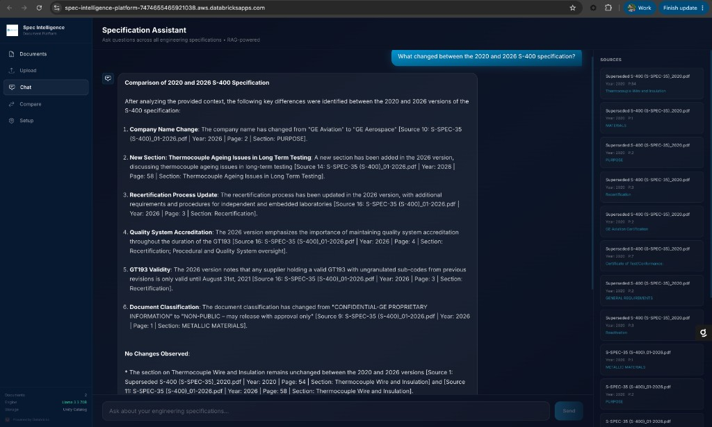

# Spec Intelligence Platform

A Databricks-native document intelligence application for managing, searching, comparing, and chatting with engineering specification PDFs.

Built with **FastAPI** (backend) + **React** (frontend), deployed as a **Databricks App** with data stored in **Unity Catalog**.



---

## What It Does

1. **Upload** — Drag-and-drop PDF specifications into the app
2. **Auto-Process** — Parses pages, extracts metadata (spec number, year, status), chunks text, generates embeddings
3. **Store** — Raw PDFs in UC Volumes, structured data in Delta tables
4. **Search & Chat** — RAG-powered Q&A across all documents with citations
5. **Compare** — Natural language comparison between any document versions

---

## Architecture

```
┌─────────────────────────────────────────────────────────┐
│                  Databricks App (FastAPI)                │
├─────────────┬─────────────┬──────────────┬──────────────┤
│   Upload    │    Chat     │   Compare    │  Documents   │
│   /api/     │   /api/     │   /api/      │   /api/      │
└──────┬──────┴──────┬──────┴──────┬───────┴──────┬───────┘
       │             │             │              │
       ▼             ▼             ▼              ▼
┌─────────────────────────────────────────────────────────┐
│              Unity Catalog (Delta Tables)                │
│  documents | pages | sections | chunks | versions       │
├─────────────────────────────────────────────────────────┤
│              UC Volume (Raw PDFs)                        │
├─────────────────────────────────────────────────────────┤
│       Foundation Model Serving (LLM + Embeddings)       │
│       databricks-meta-llama-3.3-70b-instruct            │
│       databricks-bge-large-en                           │
└─────────────────────────────────────────────────────────┘
```

---

## Client Configuration Guide

### What You NEED to Change

| Setting | File | Description |
|---------|------|-------------|
| `SPEC_CATALOG` | `app/config.py`, `databricks.yml` | Your Unity Catalog name |
| `SPEC_SCHEMA` | `app/config.py`, `databricks.yml` | Schema name within the catalog |
| `DATABRICKS_HOST` | `databricks.yml` | Your workspace URL |
| `DATABRICKS_WAREHOUSE_ID` | `databricks.yml` | Your SQL Warehouse ID |
| `workspace.host` | `databricks.yml` | Your workspace URL (under targets) |
| `workspace.profile` | `databricks.yml` | Your Databricks CLI profile name |

### What You CAN Customize (Optional)

| Setting | File | Default | Description |
|---------|------|---------|-------------|
| `LLM_ENDPOINT` | `app/config.py` | `databricks-meta-llama-3-3-70b-instruct` | LLM model endpoint name |
| `EMBEDDING_ENDPOINT` | `app/config.py` | `databricks-bge-large-en` | Embedding model endpoint |
| `CHUNK_SIZE` | `app/config.py` | `1000` | Characters per chunk for RAG |
| `CHUNK_OVERLAP` | `app/config.py` | `200` | Overlap between chunks |
| `LLM_TEMPERATURE` | `app/config.py` | `0.1` | LLM response creativity |
| `LLM_MAX_TOKENS` | `app/config.py` | `4096` | Max tokens per response |
| App name | `databricks.yml` | `spec-intelligence-platform` | Name shown in Databricks |

### What You DON'T Need to Change

- Table schemas (auto-created on first upload)
- PDF parsing logic (handles any PDF)
- Frontend code (generic, works for any specs)
- API routes (all generic)

---

## Deployment Steps

### Prerequisites

- Databricks workspace with:
  - Unity Catalog enabled
  - SQL Warehouse (Serverless recommended)
  - Foundation Model serving endpoints enabled
- Databricks CLI installed and configured
- A catalog where your service principal has write access

### 1. Configure

Edit `databricks.yml`:

```yaml
resources:
  apps:
    spec-intelligence-platform:
      config:
        env:
          - name: DATABRICKS_HOST
            value: https://YOUR-WORKSPACE.cloud.databricks.com
          - name: DATABRICKS_WAREHOUSE_ID
            value: "YOUR_WAREHOUSE_ID"
          - name: SPEC_CATALOG
            value: your_catalog_name
          - name: SPEC_SCHEMA
            value: your_schema_name

targets:
  dev:
    workspace:
      host: https://YOUR-WORKSPACE.cloud.databricks.com
      profile: your-cli-profile
```

### 2. Deploy

```bash
# Deploy the bundle
databricks bundle deploy

# Create the app deployment
databricks apps deploy spec-intelligence-platform \
  --source-code-path /Workspace/Users/YOUR_EMAIL/.bundle/spec-intelligence-platform/dev/files/app
```

### 3. Grant Permissions

After first deployment, grant the app's service principal access:

```sql
-- Find the SP client ID from: databricks apps get spec-intelligence-platform
GRANT ALL PRIVILEGES ON SCHEMA catalog.schema TO `SERVICE_PRINCIPAL_CLIENT_ID`;
GRANT ALL PRIVILEGES ON VOLUME catalog.schema.raw_documents TO `SERVICE_PRINCIPAL_CLIENT_ID`;
```

### 4. Upload Documents

Open the app URL and upload PDFs via the Upload page. The system auto-creates all tables on first upload.

---

## Project Structure

```
app/
├── main.py                      # FastAPI app entry point
├── config.py                    # All configuration (edit this!)
├── app.yaml                     # Databricks App manifest
├── requirements.txt             # Python dependencies
├── routes/
│   ├── documents.py             # Upload, list, detail endpoints
│   ├── chat.py                  # RAG chatbot endpoint
│   ├── compare.py               # Document comparison endpoint
│   ├── setup.py                 # Manual table setup endpoint
│   └── health.py                # Health check
├── services/
│   ├── document_pipeline.py     # End-to-end upload processing
│   ├── pdf_parser.py            # PDF text extraction (PyMuPDF/pdfplumber)
│   ├── metadata_extractor.py    # LLM + regex metadata extraction
│   ├── chunker.py               # Section detection + text chunking
│   ├── llm_service.py           # LLM API wrapper
│   ├── uc_repository.py         # Unity Catalog SQL operations
│   ├── uc_setup.py              # Table creation DDL
│   ├── comparison_service.py    # Document comparison logic
│   ├── rag_chatbot.py           # RAG + comparison chat
│   └── vector_search_service.py # Vector search (optional)
└── frontend/
    └── dist/                    # Pre-built React frontend
databricks.yml                   # Databricks Asset Bundle config
```

---

## API Endpoints

| Method | Path | Description |
|--------|------|-------------|
| `POST` | `/api/documents/upload` | Upload and process a PDF |
| `GET` | `/api/documents` | List all documents |
| `GET` | `/api/documents/{id}` | Get document details |
| `GET` | `/api/documents/{id}/sections` | Get document sections |
| `POST` | `/api/chat` | RAG chatbot (Q&A + comparison) |
| `POST` | `/api/compare` | Multi-document comparison |
| `POST` | `/api/setup` | Manually trigger table setup |
| `GET` | `/api/health` | Health check |

---

## How Comparison Works

When a user asks "What changed between 2020 and 2026?":

1. **Intent Detection** — Regex detects comparison keywords + extracts years/spec numbers
2. **Document Resolution** — Finds matching documents in the database (falls back to all docs)
3. **Section Retrieval** — Pulls key sections from each document version via SQL
4. **LLM Comparison** — Single LLM call compares sections and highlights differences
5. **Response** — Formatted answer with citations in ~30 seconds

---

## Adding New Document Types

The system handles any PDF. Metadata extraction adapts via:

- **Filename patterns** — Edit regex in `app/services/metadata_extractor.py`
- **LLM prompt** — Edit `EXTRACTION_PROMPT` in the same file
- **Section detection** — Edit patterns in `app/services/chunker.py`

---

## Troubleshooting

| Issue | Solution |
|-------|----------|
| Upload fails | Check SP has WRITE on schema + volume |
| Chat returns empty | Check LLM endpoint is accessible to SP |
| Comparison timeout | Normal for very large docs; chat comparison uses key sections |
| Tables not created | Call `POST /api/setup` or upload a document (auto-creates) |
| App not loading | Check `databricks apps logs <name>` for errors |

---

## License

Internal use only. Configured for Element Materials Technology engineering specifications.
